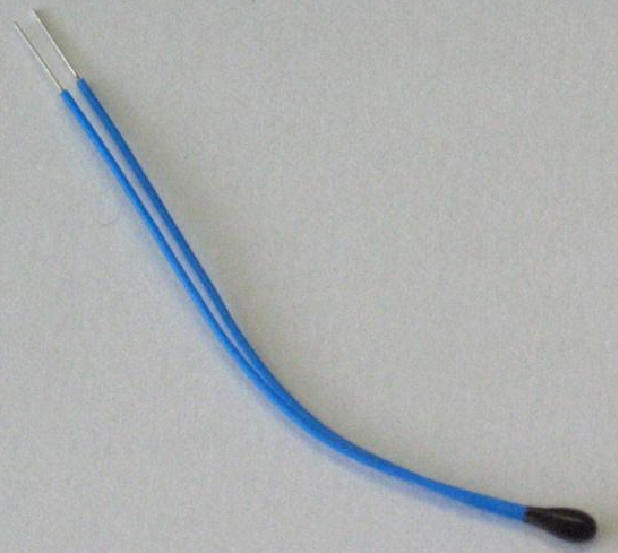
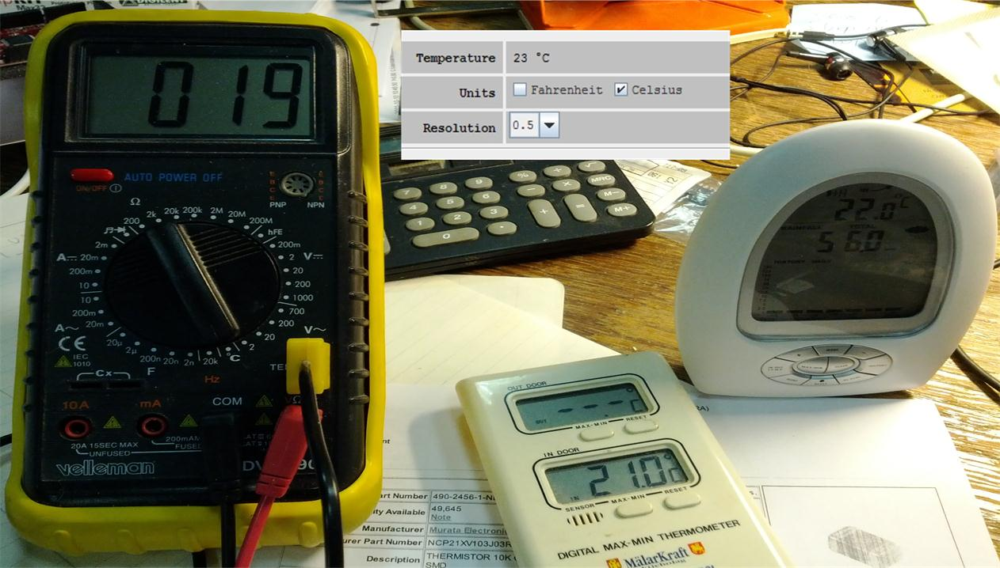

You need

  * RJ-45 patch cables or similar.
  * A stable +9V - +28V DC power source.
  * A host computer with a serial or USB interface.

The Kelvin module is powered from the CAN4VSCP bus. [This
article](https://github.com/grodansparadis/vscp/wiki/Connecting-CAN4VSCP-devices-together)
have information on how the bus is powered and set up. Follow it for a
reliable setup. Don't forget the 120 ohm terminators at each end of the
bus. `They are important` You can
activate the on board terminator on the Paris module if it is located at
one end of your bus.

When you power the module by inserting the RJ-45 cable the red LED on
the board should light up to indicate it is powered. This is just a
power indicator LED. When you power the board for the first time the
green led starts to blink to indicate that the module search for a
nickname. During normal operation this LED should light steady.

Remember that there should be `at least two` CAN4VSCP (or other CAN device set to 125kbps) devices (one additional). If you use the [Frankfurt RS-232](https://grodansparadis.github.io/can4vscp-frankfurt-rs232) or some other bus interface one additional module is needed. A single device can't talk by itself on a bus. It's an error.

# Connecting temperature sensor(s)

To just test that communication works you don't need to install any external temperature sensors. You can work with the internal sensor. By default it will send the board temperature in degrees Celsius every 30 seconds. You can view VSCP traffic on the CAN4VSCP bus with all CAN tools set to 125kbit/s but (VSCP Works+)(https://grodansparadis.github.io/vscp-works-qt/#/) makes handling, configuring, diagnosing VSCP stuff a lot more easy. So this may be the time to get to know this piece of software that works on both Linux and Window.

The internal temperature sensor does not show the room temperature, it is heated by the processor and other things on the PCB so it will always give a bit of a high value. You can calibrate away this error if you want. See the [configuration section](./configure.md).

Eventually you probably want to connect external temperature sensors to the module. You can connect any 10 Kohm NTC temperature sensor (thermistor) to the Kelvin NTC10K module. It helps if you know the β value of it for the temperature range you want to work in. You can get sensors and sensors on cables of different length from most electronics suppliers.

A maximum of five external NTC sensor can be connected to the Kelvin NTC10KA module. It is recommended to use NTC thermistors with 10K @ 25 °C types for best result. There are sensors available for all kinds of temperature measurement needs. As noted above you need the β constant value from the sensors datasheet or to be able to use it with the Kelvin NTC10KA module.You set this value in the [β-register for the sensor](./registers?id=%ce%b2-constant-registers).

The main advantage for a NTC sensor is that it is low cost and still is both fast and gives good readings. You can get it from anywhere and you can get it in any type and dimension. NTC resistor is also not sensitive to cable length. Using a CAT-5e cable (4 pairs with AWG 24) we will experience something like 9.38 ohms/100m which will not effect a 10K NTC thermistor that much.

Connect the thermistor to the Kelvin NTC10KA by connecting one end of it to +5VDC and the other end to one of the temperature inputs. A thermistor is not subject to polarity considerations so you can connect it in any way you want. You need to setup the β constant value for the sensor to get correct temperature measurements. The pinout for the terminal block is in the [hardware section](./hardware?id=terminal-block).

===== To measure temperature =====

If you want to measure a temperature, for a room for example, you will soon realize that temperature measurements has more to it then just hook up a sensor and measure the temperature. Look at the picture above.

Each of the sensors shows a different temperature even when the sensor are on the same desk. If you walk around in the room things will be even more complex. Three sensors of the same type but on different height will show different results.

The readings from the sensors of the Kelvin NTC module is given with two decimals. Does that mean we have 0.01°C precision? Unfortunately not! The thermistor has error and the analog reading circuitry (ADC) has error.

We can approximate the expected error by first taking into account the thermistor resistance error. The thermistor is correct to 1%, which means that at 25°C it can read 10,100 to 9900 ohms. At around 25°C a difference of 450 ohms represents 1°C so 1% error means about +-0.25°C (you may be able to calibrate this away by determining the resistance of the thermistor in a 0°C ice bath and removing any offset). You can also go for a 0.1% thermistor which will reduce the possible resistance error down to +-0.03°C

Then there is the error of the ADC, for every bit that it is wrong the resistance (around 25°C) can be off by about 50 ohms. This isn't too bad, and is a smaller error than the thermistor error itself +-(0.1°C) but there is no way to calibrate it 'away' - just a higher precision ADC (12-16 bits instead of 10) will give you more precise readings

In general, we think thermistors are higher precision than thermocouples, or most low cost digital sensors, but you will not get better than +-0.1°C accuracy on it with a 1% thermistor and we would suggest assuming no better than +-0.5°C.

You will in addition to this notice that the on-board sensor (sensor 6) will show a temperature that is higher then what you should expect, The same is true if you connect a sensor directly to the board. This is due to the fact that the electronics on the board generate heat. This heat flows very well through the copper of the board giving faulty readings. The solution is to take away a degree or two from the reading.

  
[filename](./bottom-copyright.md ':include')
